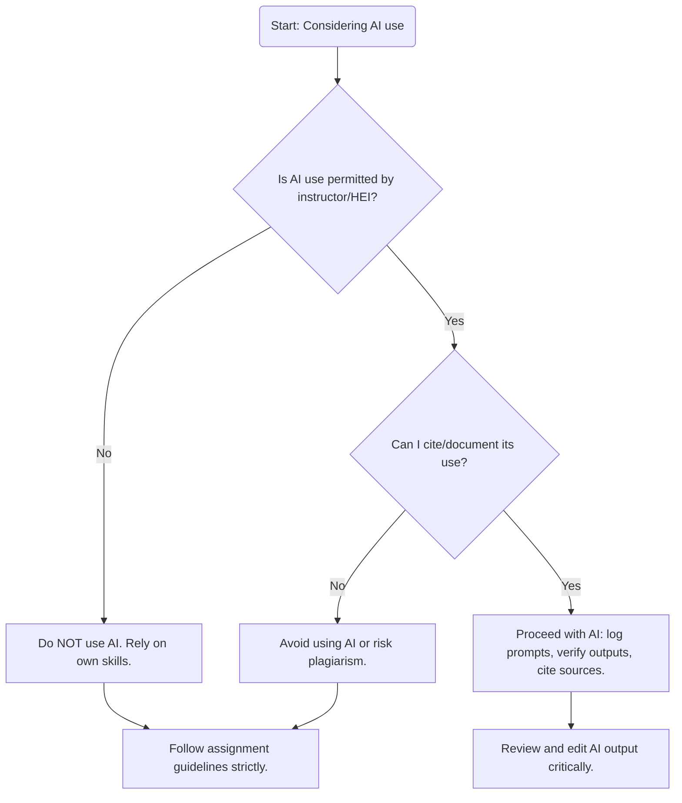

# Executive Summary  

This report outlines a detailed plan for a 35–40 slide presentation titled **“Responsible AI Documentation & Ethical AI Practices”**, designed for undergraduate and postgraduate engineering students. The slides integrate Indian academic integrity laws (UGC, 2018 Regulations) with global AI ethics frameworks (UNESCO 2023 Guidance on GenAI, NIST AI Risk Management Framework 1.0, OECD AI Principles, ISO/IEC 42001:2023) and recent peer-reviewed research (2023–2025) to address AI-enabled plagiarism and promote best practices.  Each slide entry includes a clear title, 3–8 bullet points of content, brief speaker notes (2–4 lines), and APA7-style citations (with DOI or official URLs). Key sections cover: (1) Foundations of responsible AI and academic integrity (definitions of plagiarism, UGC policy scope); (2) Core Responsible AI principles (fairness, transparency, accountability, etc. from OECD/NIST/ISO/UNESCO) framed for engineers; (3) **Engineering case scenarios** (e.g. ChatGPT-written assignment, AI-generated lab report, code, literature review, hallucinated references, group project AI use, AI during exams). Each scenario slide includes: Situation, Ethical analysis, UGC perspective, discussion prompts, recommended practice, and supporting citations. (4) **AI Documentation Practices** (prompt logs, AI usage registers, disclosure statements with example text), a decision-tree flowchart (Mermaid) for AI use, and a verification checklist table for AI outputs. (5) Two **Classroom Activities** (with instructions/timing) to engage students. Visual suggestions (icons, infographics, QR codes) are provided for each slide, and QR codes are recommended linking to official UGC and UNESCO pages. Finally, a prioritized list of authoritative sources (UGC, UNESCO, NIST, OECD, ISO, key journal articles) is given. This structured slide plan aims to equip engineering educators with an evidence-based, interactive lecture on ethical AI use and documentation.

## Priority Sources and URLs  
- **UGC (2018)**: *Promotion of Academic Integrity and Prevention of Plagiarism in HEIs* – Official Regulations (UGC website PDF).  
- **UNESCO (2023)**: *Guidance on Generative AI in Education and Research* – Global policy guidance (unesco.org).  
- **NIST (2023)**: *AI Risk Management Framework (AI RMF 1.0)* – Trustworthy AI attributes (NIST publication).  
- **OECD (2019, updated 2024)**: *OECD AI Principles* – Intergovernmental AI ethics standard (oecd.org).  
- **ISO/IEC 42001:2023**: *AI Management System Standard* – Framework for AI governance (ISO summary).  
- **Kovari et al. (2025)**: *Ethical use of ChatGPT in Education* (Frontiers in Education) – AI plagiarism strategies.  
- **Jarrah et al. (2023)**: *Using ChatGPT…not plagiarism* (OJ CMT) – AI citation & integrity.  
- **Dwivedi et al. (2023)**: *“So what if ChatGPT wrote it?”* (IJIM) – GenAI opportunities & limits.  
- **Kampa et al. (2025)**: *Academic integrity in GenAI era* (Frontiers in Education) – Education vs. punishment.  

## Slide 1: **Title Slide – Responsible AI Documentation & Ethical AI Practices**  
- Content: Presentation title, instructor name/affiliation, date, module overview.  
- Speaker Notes: Introduce the topic as a workshop on ethical AI use in engineering education, emphasizing academic integrity in the age of ChatGPT and similar tools.  
- **Visual:** Title background with AI/ethical icon (e.g. balanced scales over code).  
- *References:* UGC (2018) regulations; UNESCO (2023) Guidance.

## Slide 2: **Why Responsible AI Matters**  
- Bullet Points:
  - AI in society: rapid adoption (e.g. ChatGPT millions of users) brings benefits *and* risks.  
  - Risks include misinformation, bias, plagiarism, security issues.  
  - Engineers must safeguard system safety and ethics (ISO/IEC42001:2023 encourages risk management and trust).  
  - Students: Understanding ethical AI ensures compliance with academic norms (UGC) and professional responsibility.  
  - *Significance:* Prepares students for future careers in AI-augmented engineering roles.  
- Speaker Notes: Highlight that AI systems lack intrinsic ethics (they “only collect information” without judgment), so we rely on rules. Connect to real events (e.g. academic cheating cases) to illustrate urgency.  
- **Visual:** Infographic of “pros and cons” of AI (e.g. lightbulb vs warning sign).  
- *References:* Kovari et al. (2025); UNESCO (2023) guidance; ISO 42001 principles.

## Slide 3: **AI in Engineering Education**  
- Bullet Points:
  - AI tools (ChatGPT, MATLAB AI, generative design software) are increasingly used in engineering coursework and research.  
  - These tools can augment learning (e.g. tutoring, coding help) but also tempt plagiarism.  
  - Engineering projects require correctness, safety, documentation – making ethical AI use critical (NIST: traceability/accountability).  
  - Students need guidance on *how* and *when* to use AI appropriately (not as shortcuts).  
- Speaker Notes: Describe examples: students might ask ChatGPT to write code or lab conclusions. Stress that as engineers, every output must be verifiable and explainable (NIST fairness/transparency).  
- **Visual:** Icon of an engineering student interacting with a computer/robot tutor.  
- *References:* Dwivedi et al. (2023); NIST AI RMF.

## Slide 4: **Learning Objectives**  
- Bullet Points:
  - Understand UGC’s Academic Integrity regulations (2018) on plagiarism.  
  - Define plagiarism vs. similarity, and responsible AI terminology (GenAI, LLMs).  
  - Identify ethical/unethical AI use in engineering scenarios.  
  - Learn principles of Trustworthy AI (fairness, transparency, accountability).  
  - Practice documenting AI use (prompt logs, citations) and classroom activities.  
- Speaker Notes: Emphasize that by end of session, students should know how to use AI **ethically**: what is allowed, how to cite AI, and how to uphold UGC rules in projects.  
- **Visual:** Checklist or target image showing the key objectives.  
- *References:* OECD AI Principles; UGC Integrity Regulations.

## Slide 5: **What is “Responsible AI”?**  
- Bullet Points:
  - **Definition:** AI designed and used in a way that is ethical, transparent, fair, and accountable.  
  - Key pillars include *human-centric design, explainability, privacy, inclusivity, robustness* (NIST Trustworthy AI characteristics).  
  - Aligns with OECD principles: innovation *with* human rights and values.  
  - In education: means using AI to enhance learning without compromising integrity or equity.  
- Speaker Notes: Explain “responsible AI” as per international guidelines: it must respect laws, ethics, and human oversight. Mention UNESCO’s human-centered approach to GenAI.  
- **Visual:** Circular diagram listing Trustworthy AI attributes (from NIST/OECD).  
- *References:* NIST AI RMF; OECD AI Principles; UNESCO (2023).

## Slide 6: **UGC Academic Integrity Regulations (2018)**  
- Bullet Points:
  - Applies to all HEI members (students, staff) for theses, dissertations, publications.  
  - **Plagiarism Definition:** “the practice of taking someone else’s work or idea and passing them as one’s own.”.  
  - Introduced *Academic Integrity Panels* at Dept/Institution level to handle cases.  
  - Requires submission of originality certificate, use of plagiarism detection tools.  
  - HEIs must educate students on responsible research conduct (curriculum, orientation).  
- Speaker Notes: Clarify that while UGC’s wording focuses on research, the spirit extends to all academic work. All coursework should follow these ethics. Mention the “levels” of plagiarism (0–40%) and penalties (briefly, if asked) for context.  
- **Visual:** Icon of a legal scale or open book with a checkmark for integrity.  
- *References:* UGC Regulations (2018); Lexology summary.

## Slide 7: **What is Plagiarism?**  
- Bullet Points:
  - Using someone else’s words, ideas, or data *without attribution* (text, code, images) is plagiarism.  
  - **Types:** Direct copying; paraphrasing without credit; reusing one’s own previous work without citation (self-plagiarism).  
  - UGC exempts *trivially common phrases*, properly quoted text, bibliography, etc.  
  - **Similarity vs. Plagiarism:** Similarity index (e.g. Turnitin %) is a *tool metric*, not automatically plagiarism. Context and intent matter.  
  - Exceeding similarity thresholds (e.g. 10%) triggers review – intentional copying is penalized.  
- Speaker Notes: Stress that paraphrasing still needs citation. Explain Turnitin’s similarity score (≥10% flagged) and that minor matches (quotes, references) are excluded by policy. Emphasize intent and academic honesty.  
- **Visual:** Comparison diagram (side-by-side): “Copied text vs Paraphrased with citation vs Original.”  
- *References:* UGC Integrity Regulations (definition).

## Slide 8: **AI-generated vs. Traditional Plagiarism**  
- Bullet Points:
  - **Traditional Plagiarism:** Copying text/ideas from published sources without credit.  
  - **AI Plagiarism:** Using AI to generate content that you present as solely your own work.  
  - Both violate integrity if undetected; AI-generated text may *not* be flagged by normal detection (it’s novel).  
  - However, UGC expects *original thought*; claiming AI’s ideas as your own parallels plagiarism.  
  - Institutions may update policies to explicitly address AI assistance (similar to quoting human collaborators).  
- Speaker Notes: Emphasize that even if no text is copied verbatim, passing off AI ideas is deceptive. Cite Kovari (2025) that AI’s core risk is plagiarism. Discuss evolving norms (some universities now require disclosing AI use).  
- **Visual:** Venn diagram or infographic contrasting “Traditional Copying” vs “AI-Generated Content (presented as original)”.  
- *References:* Kovari et al. (2025); Jarrah et al. (2023) on citation.

## Slide 9: **Similarity Index vs. Plagiarism**  
- Bullet Points:
  - **Similarity Index:** Percentage of text matching other sources (as reported by tools like Turnitin).  
  - **Interpretation:** UGC “Level 0” permits ≤10% similarity (often no penalty), Level 1 is 10–40% (minor plagiarism).  
  - An AI’s output can be 0% similar (unique wording) but still be unethically unoriginal.  
  - *Key Point:* Low similarity ≠ proof of honesty. Faculty judgment on intent and originality is crucial.  
  - Always **cite all external ideas** (including those from AI) to avoid plagiarism accusations.  
- Speaker Notes: Explain with an example: an essay entirely generated by ChatGPT may show low similarity but is still cheating if the student did not write it. Emphasize combining similarity report with manual review.  
- **Visual:** Chart showing similarity score vs plagiarism risk; or icon of a magnifying glass over text.  
- *References:* UGC (2018) Levels of Plagiarism; Jarrah et al. (2023) on citing AI.

## Slide 10: **Institutional Responsibilities (UGC Guidelines)**  
- Bullet Points:
  - HEIs must *teach* academic integrity: include it in curricula, conduct orientation, train faculty on ethics tools.  
  - Establish a Departmental and Institutional Academic Integrity Panel (DAIP/IAIP) to handle allegations.  
  - Require submission of a **declaration** with theses/reports confirming originality (e.g. Shodhganga repository for dissertations).  
  - Use plagiarism-check software widely; make it accessible to all researchers.  
  - Consequence enforcement: follow the UGC’s tiered penalty structure for violations.  
- Speaker Notes: Emphasize the proactive role of universities: not just punishing plagiarism, but preventing it through education. Mention UGC’s expectation of institutional “anti-plagiarism policies”.  
- **Visual:** Flowchart of UGC policy enforcement: (Student work → Plagiarism check → Integrity Panel → Outcome).  
- *References:* UGC Regulations.

## Slide 11: **Principles of Responsible AI**  
- Bullet Points:
  - **Human Rights & Values:** OECD: AI must respect human rights, fairness, privacy.  
  - **Transparency & Explainability:** Disclose AI use, model limits, and decision logic where feasible.  
  - **Accountability:** Assign responsibility for AI’s outputs; maintain traceability (logs, versioning).  
  - **Fairness (No Bias):** Avoid discrimination; test AI outputs for bias (NIST “fair” attribute).  
  - **Privacy & Security:** Protect personal data and ensure AI systems are robust/safe.  
- Speaker Notes: Walk through each principle with examples (e.g. “If AI suggests exam answers, transparency means the student should note it did so”). Cite NIST’s list of trustworthy AI traits including fair, accountable, privacy-enhanced.  
- **Visual:** Icons or infographic tiles for each principle (e.g. lock for privacy, scales for fairness, eye for transparency).  
- *References:* OECD AI Principles; NIST AI RMF.

## Slide 12: **Transparency & Explainability**  
- Bullet Points:
  - “Make it clear to stakeholders (students, instructors) *how* AI was used”.  
  - AI outputs should be accompanied by understandable explanation or context.  
  - Example practice: annotate AI-generated text with comments, or use AI only in areas where understanding is possible.  
  - In exam settings: ensure any AI hints are disclosed. Transparency fosters trust (UNESCO: human-centered verification).  
- Speaker Notes: Emphasize that in engineering, outputs (reports, code) must be explainable. If you submit AI-generated material, the instructor should be able to see the rationale/prompt (transparency). This aligns with the OECD guideline of disclosing AI processes.  
- **Visual:** Infographic of a dialog bubble showing AI output with a “closed lock” turning into an “open lock” after explanation.  
- *References:* OECD (2023) – “transparency and responsible disclosure”.

## Slide 13: **Fairness & Bias**  
- Bullet Points:
  - Ensure AI-generated outputs do not discriminate (race, gender, etc.).  
  - In engineering content, check for technical neutrality (e.g. data sets should be representative).  
  - Train/test any AI tools on diverse data if used for e.g. demographic studies.  
  - **Practice:** Critically review AI outputs: If an AI answer seems biased or one-sided, investigate and correct it.  
- Speaker Notes: Discuss how AI can perpetuate stereotypes or errors (Dwivedi et al., 2023 noted biases in GenAI). Engineering projects should aim for equity and fairness (e.g. fair resource allocation algorithms).  
- **Visual:** Icon showing scales balanced or a “fairness gauge” with diverse group.  
- *References:* NIST Trustworthy AI characteristics (fair).

## Slide 14: **Privacy & Data Protection**  
- Bullet Points:
  - Avoid feeding sensitive data into public AI tools (e.g. patient or proprietary info).  
  - Anonymize any data when experimenting with AI tools, or use offline models.  
  - Comply with data policies: UGC/Institutional data use guidelines, GDPR/India’s DP law as applicable.  
  - **Practice:** Read the terms of any AI service; prefer “privacy-enhanced” models (NIST’s ideal).  
- Speaker Notes: Emphasize that students should not expose personal or confidential data to unknown AI platforms. Mention UNESCO’s concern about data privacy and the need for regulation.  
- **Visual:** Shield icon with lock or data file with protective hands.  
- *References:* NIST (2023) – privacy-enhanced AI; UNESCO (AI and privacy guidance).

## Slide 15: **Accountability & Governance**  
- Bullet Points:
  - Ensure **human accountability**: students/professors are responsible for final outputs (NIST emphasizes this).  
  - Maintain documentation and audit trails of AI usage (traceability of data/process).  
  - Align with institutional policy: if AI is used, follow guidelines (e.g. disclose it, follow exam rules).  
  - Ongoing risk management: regularly evaluate AI’s performance and update practices (ISO 42001 “PDCA” approach).  
- Speaker Notes: Stress that even if AI “did the work”, the user holds responsibility. Cite NIST: “accountability presupposes transparency”. In practice, always double-check AI outputs and be prepared to answer for them.  
- **Visual:** Flowchart icon of governance (roles, policies) or stamp of “certified”.  
- *References:* NIST AI RMF – accountability and traceability.

## Slide 16: **Human-in-the-Loop & Skills Development**  
- Bullet Points:
  - Keep humans engaged: AI should *assist*, not replace, critical thinking or key skills.  
  - Learn to prompt effectively, but verify AI outputs with domain knowledge.  
  - Encourage student reflection: explain output in own words; don’t submit blind AI answers.  
  - UGC/Universities should teach prompt literacy, digital ethics (UDC requires training in research conduct).  
- Speaker Notes: Emphasize upskilling: use AI to improve your work, but always add original human insight. UNESCO suggests integrating AI into curriculum with proper guidance (e.g. question framing, outcome evaluation).  
- **Visual:** Icon of a person operating a robot or AI assistant, highlighting collaboration.  
- *References:* UNESCO (2023) human-centered GenAI guidance; UGC mandates ethics training.

## Slide 17: **Scenario 1: ChatGPT Writes My Assignment**  
- Bullet Points:
  - **Situation:** A student asks ChatGPT to draft an entire Data Structures essay, then makes only minor edits.  
  - **Ethical?** No – this misrepresents the student’s own work; essentially plagiarism of AI output.  
  - **UGC Perspective:** UGC defines plagiarism as taking “someone else’s work or idea” as one’s own. Submitting AI-generated text violates academic integrity.  
  - **Discussion:** *Who is the author?* If student cited AI, is it honest? Would marks be valid if work isn’t self-generated?  
  - **Practice:** Use AI **sparingly**: for brainstorming or outlines. Write solutions in your own words and cite any AI assistance. Keep a *prompt log* as evidence of work done.  
- Speaker Notes: Explain that using AI as a shortcut denies learning. Reference Kovari et al.: “ChatGPT…has very serious academic integrity implications: at its core is plagiarism”. Encourage transparency (e.g. "I got ideas from ChatGPT and added my analysis").  
- **Visual:** Split-image: Left shows student talking to AI bubble, right shows plagiarism warning icon.  
- *References:* Kovari et al. (2025); UGC (2018) definition of plagiarism; Jarrah et al. (2023) on citing AI.

## Slide 18: **Scenario 2: AI-Generated Lab Report**  
- Bullet Points:
  - **Situation:** After completing experiments, a student uses ChatGPT to write up results/analysis for a lab report.  
  - **Ethical?** No – submitting text from AI (without attribution) bypasses the learning process. Even wrong AI-generated analysis is attributed to student.  
  - **UGC Perspective:** Lab work should reflect the student’s understanding. Misrepresenting AI’s explanation as one’s own breaches integrity norms.  
  - **Discussion:** *Is AI allowed as a tool after doing the experiment?* How to check AI’s answers (it may “hallucinate” data)? If AI errors lead to wrong report, who is accountable?  
  - **Practice:** Write the report yourself. Use AI only to refine language or clarify concepts, and then rewrite in your words. Always verify AI’s facts – “ChatGPT references are generally incorrect…require careful double-checking”.  
- Speaker Notes: Highlight that while AI might help with grammar, it should not replace the core analysis. Cite Giuggioli & Pellegrini (2023) point: ChatGPT’s outputs can lack logical detail and have incorrect references. Stress own lab conclusions matter most.  
- **Visual:** Icon of a test tube or lab equipment crossed with AI chat bubble.  
- *References:* Kovari et al. (2025); UGC Regulations; AI accuracy issues.

## Slide 19: **Scenario 3: AI-Generated Python Code**  
- Bullet Points:
  - **Situation:** A computer engineering student copies code generated by ChatGPT for an algorithms assignment, without understanding or debugging it.  
  - **Ethical?** Only if properly understood and credited. Blindly submitting AI code as original work is not ethical.  
  - **UGC Perspective:** Code is an “intellectual work.” Using AI’s code without attribution may count as plagiarism. Also, submitting unvetted code is risky (bugs/cheats).  
  - **Discussion:** If the code passes tests but student can’t explain it, is that fair to evaluator? Should tools like AI be treated like code libraries (citing “OpenAI API” vs claim authorship)?  
  - **Practice:** Use AI to help with syntax or ideas, but **test and learn** every line. Before submission, debug and optimize code yourself. Cite AI assistance if required by course policy. Remember: NIST stresses accountability – you are responsible for code outputs.  
- Speaker Notes: Emphasize engineers’ responsibility: you must understand and verify your code. Cite NIST: “trustworthy AI depends on accountability”. If caught cheating, academic penalties apply. Encourage including comments like “co-developed with AI” if allowed.  
- **Visual:** Illustration of a student writing code next to a robot; or a code window with an alert icon.  
- *References:* NIST AI RMF (trustworthy traits); Jarrah et al. (2023) on citing AI.

## Slide 20: **Scenario 4: AI-Generated Literature Review**  
- Bullet Points:
  - **Situation:** A student asks ChatGPT to summarize literature and present it as a “review” section in their thesis.  
  - **Ethical?** No – ChatGPT may mix factual text and invented content. Passing it off as your own synthesis is dishonest.  
  - **UGC Perspective:** All cited ideas in a review must be verifiable. Relying on AI to list sources (often inaccurate) violates citation norms.  
  - **Discussion:** If ChatGPT suggests papers, how do you verify them? What if it hallucinates a reference? Is summarizing a ChatGPT answer allowed if rephrased (with credit)?  
  - **Practice:** Conduct your own literature search. Use AI to clarify concepts only, then cite real papers. Cross-check every reference – “titles and authors…are misstated”. Treat AI as an assistant, not a source.  
- Speaker Notes: Warn about ChatGPT’s hallucinations: it can invent articles. Quote: “Any ChatGPT references are generally incorrect… require careful double-checking”. Encourage critical thinking: even if AI lists a paper, find and read it yourself.  
- **Visual:** Graphic of a book/journal icon with a question mark (signifying doubt about sources).  
- *References:* Kovari et al. (2025); Jarrah et al. (2023); comment on AI hallucinations.

## Slide 21: **Scenario 5: AI Hallucinated References**  
- Bullet Points:
  - **Situation:** ChatGPT provides a list of citations (e.g. author names, journals) for a topic, but these references do not actually exist. The student uses them in an assignment.  
  - **Ethical?** No – Using made-up sources is plagiarism/fraud. It undermines trust and can propagate false information.  
  - **UGC Perspective:** Academic work must be verifiable. Submitting fake citations violates originality and honesty requirements.  
  - **Discussion:** How can students detect AI’s bogus citations? What are the consequences of publishing false info? Who is to blame – the student or the AI?  
  - **Practice:** Always verify every reference in a database (Google Scholar, etc.) before citing. If ChatGPT suggests sources, treat them as leads *only*. Promote information literacy: cross-check AI output against reliable databases.  
- Speaker Notes: Stress that this is a known issue (“AI hallucinations”). Even good-faith use requires verification. Emphasize integrity: if a source can’t be found, don’t use it. Cite reliable methodology (like CWE: cite actual DOI).  
- **Visual:** Icon of a broken chain or magnifying glass on a book with a red “X.”  
- *References:* Kovari et al. (2025); note on ChatGPT’s incorrect references.

## Slide 22: **Scenario 6: Group Project Using AI**  
- Bullet Points:
  - **Situation:** In a team design project, one member heavily uses ChatGPT to write project sections; the group submits the combined report without noting this.  
  - **Ethical?** Mixed – if all group members agree and benefit, it might be acceptable *with disclosure*. Unilateral AI use without team consent or credit is unfair.  
  - **UGC Perspective:** Group work demands equal contribution. UGC expects honesty in group submissions; undisclosed AI use can be viewed as one student unduly benefiting off others’ work.  
  - **Discussion:** How should AI use be negotiated in team settings? If AI designs part of a solution (e.g. code or analysis), do all get credit? What if one member did no actual work?  
  - **Practice:** Decide AI usage at project outset. Document who used AI and where. Consider writing a brief “AI use section” in the report. Leverage AI for brainstorming, but ensure each member adds original value. Peer review within team can catch inconsistencies (no AI can easily “collaborate” like humans).  
- Speaker Notes: Discuss fairness: teamwork implies collective responsibility. Reference Kovari et al. and others: group work naturally resists hidden AI use (“group tasks require communication AI cannot mimic”). Advise transparency (e.g. footnote “analysis generated with AI, edited by team”).  
- **Visual:** Diagram of team around a table with an AI assistant icon, highlighting communication.  
- *References:* Kovari et al. (2025); group work AI detection discussion.

## Slide 23: **Scenario 7: AI During Online Exam**  
- Bullet Points:
  - **Situation:** A student uses ChatGPT or similar generative AI during a timed online quiz/closed-book exam to answer questions.  
  - **Ethical?** No (if prohibited). Using AI when not allowed is cheating and violates exam rules.  
  - **UGC Perspective:** Presenting work done during a closed-book assessment implies the student’s own effort. Using AI covertly breaches the “original work” requirement.  
  - **Discussion:** If exams become open-book, how do we define unauthorized AI use? Should AI be *completely* banned, or allowed under supervision? How to enforce fairness?  
  - **Practice:** Strictly follow exam policies. If AI use is banned, do not attempt it. Instructors can mitigate by using in-person exams or oral defenses (AI can’t assist in real time). Promote honor codes emphasizing integrity under pressure.  
- Speaker Notes: Highlight that many institutions have explicitly banned AI in examinations. Mention strategies educators use: oral/viva voce assessments to verify understanding. Emphasize personal integrity and the risk of detection (some tools can flag AI use patterns).  
- **Visual:** Icon of a clipboard with a cross or a computer with a “no AI” symbol.  
- *References:* Kovari et al. (2025) on online assessment risks; UNESCO (ChatGPT usage guidelines).

## Slide 24: **AI Documentation Framework**  
- Bullet Points:
  - **Why Document?** Ensures transparency and reproducibility (aligns with NIST/ISO traceability).  
  - **Components:** Keep a *Prompt Log* (records of AI prompts, dates, outputs); an *AI Usage Register* (summary table of where AI was used); and an *AI Disclosure* statement.  
  - **Benefits:** Facilitates auditing of work (NIST: traceability, accountability).  
  - Example Items: Prompt+response snapshots, description of AI’s role in project, citations for AI use.  
- Speaker Notes: Explain that documenting AI use is akin to citing any tool. NIST recommends traceability of processes. ISO 42001 suggests continuous monitoring; these logs serve that function. This practice both deters misconduct and helps if questions arise about authorship.  
- **Visual:** Flowchart or diagram showing an AI in the loop with logs (e.g. arrows from student to AI to logbook).  
- *References:* NIST AI RMF (traceability/accountability); ISO 42001 summary on risk management.

## Slide 25: **Prompt Log & AI Usage Register (Templates)**  
- Bullet Points:
  - **Prompt Log:** For each prompt, note date/time, AI model version, prompt text, and AI’s raw answer.  
  - **Usage Register:** Table listing project tasks (e.g. “code debugging”, “literature summary”), description of AI’s contribution, and student’s follow-up (edit/comment).  
  - **Example Entry (Prompt Log):** “2026-07-12: Asked ChatGPT ‘Explain Fourier transform intuitive.’ AI response… (See transcript). Edited to include specific example.”  
  - **Purpose:** Creates an audit trail. Encourages reflection on AI usage. Supports citing AI in reports (APA-style if needed).  
- Speaker Notes: Walk through a mock prompt log entry and usage log entry. Emphasize detail: even noting “chatGPT provided the draft, student revised it.” This shows proactive honesty. Link to Jarrah et al. (2023) on proper citation of AI outputs.  
- **Visual:** Screenshot-like mockup of a table with prompts and usage examples.  
- *References:* Jarrah et al. (2023) on citing AI contributions; NIST/ISO on documentation principles.

## Slide 26: **AI Disclosure Statement & Citations**  
- Bullet Points:
  - **Disclosure Statement:** A short declaration to include in reports, e.g.:  
    > *“Parts of this work used ChatGPT (OpenAI) on [date]. All AI-generated content has been reviewed and edited by the author.”*  
  - **Why:** Aligns with academic honesty and some emerging university policies. Transparency about AI use is responsible conduct (similar to citing tools like “MATLAB”).  
  - **Citing AI:** Follow APA 7th guidelines. E.g., in-text: (OpenAI, 2023). Reference list entry: “OpenAI. (2023). ChatGPT (GPT-4) [Large language model].” (see APA blog).  
  - **Example Citation:** *“OpenAI (2023). ChatGPT [Computer software]. https://openai.com/chatgpt”* or as directed by specific style guides.  
- Speaker Notes: Provide actual examples of AI citations (mention APA style citation). Emphasize that acknowledging AI isn’t lenient, but shows integrity. Point to resources (like APA blog on citing ChatGPT) for formatting.  
- **Visual:** Sample text box showing a disclosure statement snippet, and a stylized reference entry for ChatGPT.  
- *References:* Jarrah et al. (2023); APA style guidelines (OpenAI blog) (external).

## Slide 27: **AI Content Verification Checklist**  
- *Visual Suggestion:* A two-column table with checks (see below).  
| **Verification Checklist**        | **Action / Notes**                                                              |
|---------------------------------|---------------------------------------------------------------------------------|
| ✔️ **Originality Check**         | Use plagiarism/AI-detection tools (e.g. Turnitin, GPTZero) to flag AI-written text.  |
| ✔️ **Accuracy & Fact-Check**     | Verify all statements and data against reliable sources (e.g. textbooks, papers).    |
| ✔️ **Explainability Test**       | Can you explain the content/solution in your own words or to a peer? If not, revise. |
| ✔️ **Bias & Sensitivity Check**  | Ensure no inappropriate or biased content (ethical review of language and examples).  |
| ✔️ **Security/Safety Review**    | For code: run tests; check for vulnerabilities or logical errors.                 |
| ✔️ **Citations & References**    | Confirm every fact/quote is properly cited. Replace any hallucinated references.  |
| ✔️ **Attribution**              | Did you acknowledge AI assistance where used (prompt logs, footnotes)?           |
- Speaker Notes: Explain each checkpoint briefly. For engineers: emphasize testing code, verifying formulas, etc. Mention that following this checklist can be part of QA before submission. If any item fails, revise the work.  
- *References:* NIST RMF (importance of testing/trustworthiness); Jarrah et al. on citations.

## Slide 28: **Decision Tree: Should I Use AI?**  

- Speaker Notes: Walk through decision nodes. If AI is banned, the branch ends. If allowed, check ability to properly document. The final branch emphasizes best practice (log, check, cite).  
- *References:* NIST & ISO stress risk management and documentation.

## Slide 29: **Classroom Activity 1: Role-Play Debate (15 min)**  
- Bullet Points:
  - **Setup:** Split class into two groups. Assign one group to argue **“AI tools like ChatGPT should be allowed in assignments”**, and the other **“AI tools should be banned to prevent cheating.”**  
  - **Task (10 min):** Each group prepares arguments (consider UGC rules, learning outcomes, fairness). Support points with examples (use provided cases).  
  - **Debate (3 min):** Each side presents 2–3 arguments.  
  - **Wrap-up (2 min):** Class votes which side was more convincing. Instructor highlights factual vs emotional points, connecting to ethical principles discussed.  
- Speaker Notes: This activity engages students in the pros/cons of AI in education. Expect arguments about learning enhancement vs fairness, policy clarity, etc. Use the debate to reinforce understanding of responsible use (e.g. both sides should mention proper citation and guidelines).  
- **Visual:** Timer icon or classroom discussion silhouette.  
- *References:* UNESCO recommends stakeholder discussion on AI impacts; Kampa et al. (2025) on talking through ethics.

## Slide 30: **Classroom Activity 2: AI Prompt Design (10 min)**  
- Bullet Points:
  - **Setup:** In pairs, students are given a simple assignment prompt (e.g. “Explain how a transistor works”).  
  - **Task (5 min):** Each pair writes two prompts: one clearly allowed (e.g. “List textbooks on this topic”), one explicitly disallowed (e.g. “Write my answer for me”).  
  - **Group Share (5 min):** Pairs exchange prompts and guess if AI use is ethical. Discuss how to frame prompts responsibly.  
  - **Debrief:** Emphasize crafting prompts that elicit help without doing the work (e.g. asking for explanations or references, not direct answers).  
- Speaker Notes: This exercise gets students thinking about how AI assistance differs from plagiarism. Encourage sharing examples of phrasing (e.g. “Summarize these notes” vs “Write essay”). Highlight good prompting practices (UNESCO: connect AI use to learning outcomes).  
- **Visual:** Illustration of two people writing on notepads with a speech bubble containing “ChatGPT” in between.  
- *References:* UNESCO suggestions on ChatGPT use (guidelines).

## Slide 31: **Key Takeaways**  
- Bullet Points:
  - **Academic Integrity is paramount:** AI does not excuse dishonesty. Always credit sources (human or AI).  
  - **Use AI as a tool, not a crutch:** Enhance learning by verifying and adding original thought.  
  - **Document and disclose:** Keep prompt logs, cite AI outputs, and follow institutional policies to stay compliant.  
  - **Trustworthy AI principles:** Apply fairness, transparency, accountability in all AI use (align with NIST/OECD/ISO guidelines).  
  - **Continuous learning:** Stay updated on evolving policies (UGC updates, AI ethics frameworks). Seek guidance when in doubt.  
- Speaker Notes: Summarize: Responsible AI use requires honesty, critical thinking, and adherence to rules. Reinforce that institutions (and future employers) value ethical practice over perfect scores. Encourage students to be pioneers of integrity in the AI era.  
- **Visual:** Bulleted list icon or lightbulb with checkmarks.  
- *References:* NIST AI RMF (trustworthy AI); UGC (integrity).

## Slide 32: **Resources & QR Codes**  
- Bullet Points:
  - **QR Code Suggestion:** Provide a QR linking to the UGC 2018 Regulations PDF (ugc.gov.in official PDF) and another to UNESCO’s GenAI Guidance page.  
  - **Other Links:** NIST AI RMF download (nist.gov) and OECD AI Principles page for deeper reading.  
  - **Library Guides:** Links to campus academic integrity policy and AI citation guides (e.g. APA/MLA for AI).  
  - **In-Text References:** Encourage scanning QR for full documents (ensures students consult primary sources).  
- Speaker Notes: Explain each resource briefly. The QR codes allow quick access to official policy documents. Emphasize that these are authoritative sources to revisit (UGC and UNESCO in particular). Provide digital versions on course site as backup.  
- **Visual:** Mock QR code images labeled “UGC PDF” and “UNESCO AI Guidance”, and icons of NIST/OECD logos.  
- *References:* UNESCO (2023) guide; UGC Regulations (2018).

## Slide 33: **Prioritized References (Examples)**  
*Include key citations and links for instructor’s reference (not on student slides). For example:*  
- University Grants Commission (2018). *Promotion of Academic Integrity and Prevention of Plagiarism* (Regulations) – [UGC PDF].  
- UNESCO (Miao & Holmes, 2023). *Guidance on Generative AI in Education and Research* – unesdoc link.  
- NIST (2023). *AI Risk Management Framework 1.0* – DOI 10.6028/NIST.AI.100-1.  
- OECD (2019). *OECD AI Principles* – [oecd.org].  
- ISO/IEC 42001:2023 – [ISO synopsis or KPMG overview].  
- Kovari, A. et al. (2025). *Ethical use of ChatGPT in Education* – Front. Educ. (DOI).  
- Jarrah, A. et al. (2023). *Using ChatGPT… plagiarism* – Online J. of Comm. & Media Tech (DOI).  
- Dwivedi, Y. et al. (2023). *“So what if ChatGPT wrote it?”* – Int. J. Inf. Mgmt (DOI).  
- Kampa, J. et al. (2025). *GenAI & Academic Integrity* – Front. Educ. (DOI).  
- (Others as needed).  
- **Visual:** Small icons next to each reference (journal, globe, book).  
- *Note:* Full APA references with DOI/URL can be included on final slides as a bibliography.  

## Slide 34: **Questions & Discussion**  
- Bullet Points:
  - Invite questions on any scenario or concept.  
  - Prompt students: “How would you handle [insert a tricky case, e.g. medical advice from AI]?”  
  - Encourage sharing experiences: “Has anyone tried using ChatGPT for coursework yet?”  
- Speaker Notes: Transition to open discussion. Use this time to clarify policy points or handle difficult queries. Reinforce that academic staff are available for guidance on ambiguous cases.  
- **Visual:** Question mark icon or speech bubbles.  
- *References:* (No citations – interactive slide.)

